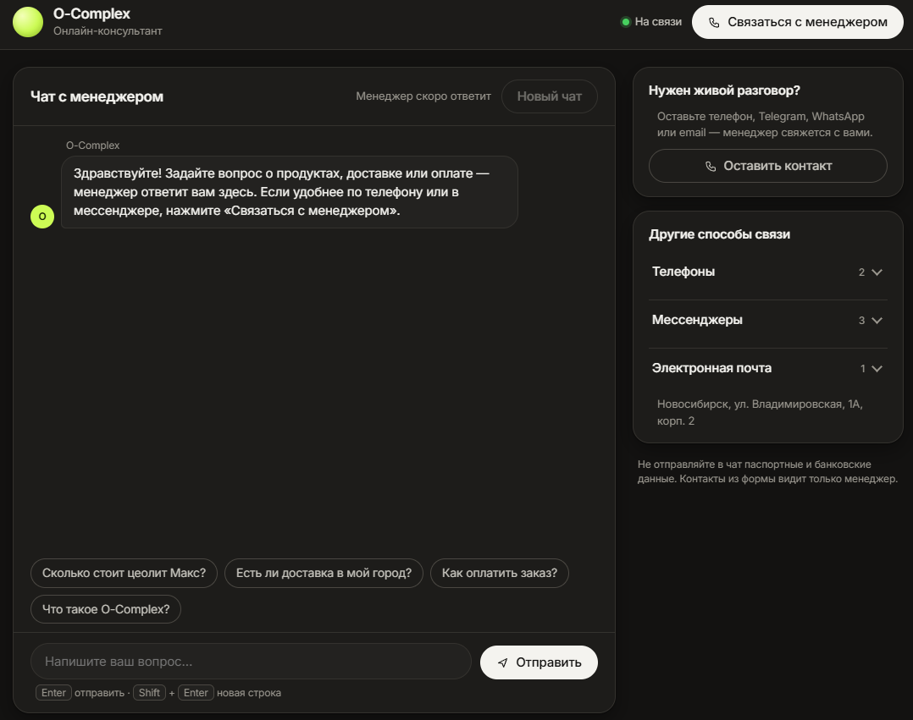
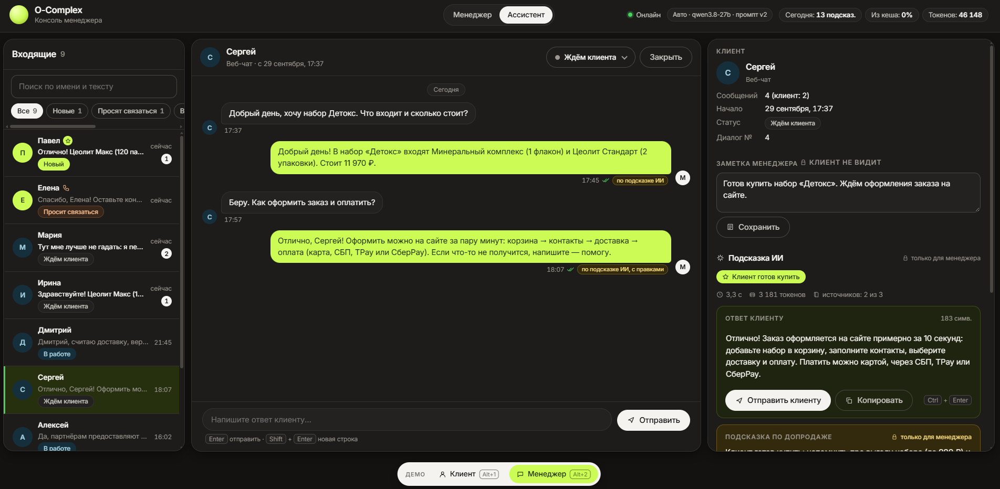
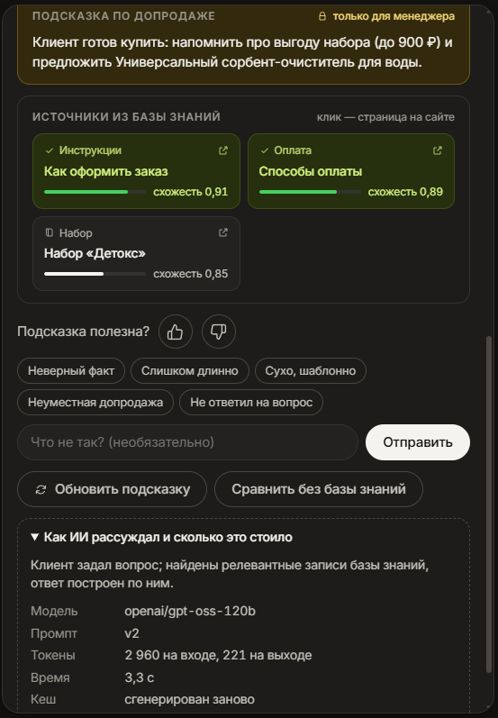

# AI-ассистент менеджера для O-Complex

**Отвечает как менеджер. Знает только факты. Не упускает горячих клиентов.**

RAG-ассистент на гибридном поиске (pgvector + полнотекст) и LLM: отвечает строго по базе знаний с источниками, оценивает
намерение клиента купить и подсказывает допродажу.

Работает в двух режимах: **подсказчик**, когда ИИ готовит ответ, а решает менеджер, и **автономный ассистент**, который
сам ведёт диалог и передаёт человеку всё рискованное.

*Прототип, сделанный в рамках тестового задания.*

> **AmoCRM подключена заглушкой:** она не выполняет сетевых вызовов, а лишь пишет в лог, какая заметка была бы
> добавлена в сделку (см. [Интеграция с AmoCRM](#интеграция-с-amocrm)).



## Возможности

- **Ответ клиенту и подсказка по допродаже** на основе базы знаний (RAG): цены, доставка, оплата, инструкции,
  программа лояльности, опт. Каждый ответ содержит источники, по которым он построен.
- **Чат клиента** с менеджером и форма «Связаться с менеджером» (телефон, Telegram, WhatsApp, Max, email).
- **Консоль менеджера**: входящие со статусами, поиск, карточка клиента с заметкой, подсказка ИИ, которую можно
  поправить и отправить одной кнопкой.
- **Два режима работы**: «Менеджер» (ИИ готовит подсказки, отвечает человек) и полностью автономный «Ассистент»
  (ИИ отвечает сам, пока менеджер отсутствует). См. [Режимы работы](#режимы-работы).
- **Скоринг**: релевантность найденных записей и намерение клиента купить (`none` / `interest` / `ready_to_buy`).
  См. [Как работает скоринг](#как-работает-скоринг).
- **Горячие клиенты**: клиент, готовый купить, помечается звездой в списке «Входящие» и поднимается выше остальных, пока
  менеджер не ответит.
- **Кнопки-ссылки под ответами**: до трёх кнопок на страницы o-complex.com (товар, «Доставка и оплата», каталог),
  подбираются по справочнику ключевых слов и не зависят от модели; ссылки, которые модель выдумала сама, вырезаются.
- **Запрос связи**: клиент оставляет способ связи, контакт и удобное время; контакт виден только в карточке менеджера и не
  попадает в переписку, заметку CRM и запросы к модели. Просьба «позвоните мне» распознаётся сама, диалог переходит в
  «Просит связаться».
- **Выбор модели**: основная (`GROQ_MODEL`), запасная (`GROQ_FALLBACK_MODEL`) и дополнительные (`GROQ_EXTRA_MODELS`,
  через запятую) задаются в `.env`. В шапке консоли менеджера видно, какая модель отвечает и работает ли она (лимит,
  недоступность), и можно выбрать, какая отвечает первой: остальные остаются запасными. По умолчанию порядок
  автоматический.
- **Защита ответов**: проверка чисел и оценочных слов по данным базы, осторожные ответы по темам здоровья, эскалация
  менеджеру, если в базе нет ответа, защита от prompt injection.
- **Обратная связь**: оценка подсказки 👍/👎 с быстрыми причинами и скрипт `scripts/feedback_report.py`: сводка по
  версиям промпта и моделям и разбор негативных случаев.
- **Версионируемые промпты**: версия (`v1`, `v2`, переменная `PROMPT_VERSION`) записывается в каждую подсказку и входит в
  ключ кеша, поэтому версии можно сравнивать.
- **Готовая база знаний**: 57 записей о продуктах и правилах магазина загружаются в pgvector при запуске, повторная
  индексация пересчитывает только изменённые записи.
- **Интеграция с AmoCRM** через идемпотентный вебхук с очередью и фоновым worker'ом: повторная доставка не создаёт дубль, при
  сбоях задача повторяется (сейчас CRM подключена заглушкой).
- **Интерфейс**: светлая и тёмная темы с переключателем, адаптивная вёрстка для узких экранов.
- **Эксплуатация**: кеш ответов, лимиты запросов и дневной бюджет, метрики Prometheus, статистика за сутки.

## Режимы работы

Переключатель **«Менеджер | Ассистент»** в шапке консоли менеджера действует на все диалоги сразу (`PUT /api/manager/away`).

| | **Менеджер** (по умолчанию) | **Ассистент** (полностью автономный) |
|---|---|---|
| Кто отвечает клиенту | менеджер | ассистент сам, если ответ безопасен |
| Что делает ИИ | готовит к каждому сообщению подсказку: ответ, допродажу, источники; менеджер правит и отправляет | отправляет ответ сам; подсказка остаётся в консоли |
| Если ответ небезопасен | — | клиент получает «передал менеджеру, он ответит здесь», диалог ждёт человека |

Ответ ассистента считается **безопасным**, если он построен на базе знаний, в нём нет предупреждений проверок (числа и
оценочные слова без опоры в данных) и нет эскалации (здоровье, врач). Дополнительно в режиме «Ассистент»:

- просьба перезвонить получает фиксированный ответ, диалог переходит в «Просит связаться», один и тот же текст
  дважды подряд не отправляется;
- клиент, готовый купить, остаётся «горячим»: ассистент ему отвечает, но диалог помечен звездой и поднят в списке
  выше остальных, пока менеджер не ответит (см. ниже).
- сообщения ассистента помечены как автоматические («автоответ ассистента»); если менеджер ответил сам, пока готовилась подсказка, ассистент молчит;
- при включении режима ассистент отвечает на неотвеченные сообщения за последние 24 часа (до 20 диалогов), используя уже
  готовые подсказки без новых запросов к модели.

## Как это работает

```text
Обращение клиента + история диалога
        │
        ▼
  Гибридный поиск по базе знаний ──► Postgres + pgvector
  (вектор + полнотекст, RRF)             ▲
        │                                │ эмбеддинги
        ▼                          Text Embeddings Inference
  LangChain-цепочка ──► Groq (LLM)       (multilingual-e5-small)
        │
        ▼
  { ответ клиенту, подсказка по допродаже, источники }
```

Если в базе нет ничего по теме обращения, ассистент не отвечает «по памяти»: он честно сообщает, что уточнит, и
подсказывает менеджеру, куда эскалировать вопрос. Записи о здоровье помечены `sensitive`, и ответы по ним строятся
осторожно («по заявлению производителя», с рекомендацией обратиться к врачу). Устройство слоёв, поиска, кеша и
проверок ответа — в [docs/ARCHITECTURE.md](docs/ARCHITECTURE.md).

## Как работает скоринг

Оценок две, обе сохраняются вместе с подсказкой и видны менеджеру.

**Релевантность найденных записей.** Поиск по базе знаний гибридный: векторный (косинусная близость) и полнотекстовый
ретриверы объединяются методом Reciprocal Rank Fusion. Запись считается подходящей, если её косинусная близость не
ниже порога `RAG_MIN_DENSE_SCORE` (по умолчанию 0,81) или её высоко поставили оба ретривера. Если подходящих записей
нет, модель получает пустой контекст и отвечает «уточню» с эскалацией вместо выдумки. Оценки записей показываются в
консоли шкалой схожести рядом с источниками.

**Намерение клиента купить** (`purchase_intent`) определяет модель по правилам промпта:

| Значение | Когда |
|---|---|
| `none` | клиент просто спрашивает |
| `interest` | сравнивает или выбирает товар |
| `ready_to_buy` | выбрал товар и спрашивает, как заказать или оплатить |

`ready_to_buy` включает флаг `priority`: в консоли подсказка получает метку «★ Клиент готов купить», в заметке для
сделки в AmoCRM появляется пометка `[ПРИОРИТЕТ: клиент готов купить]`, кнопки-ссылки на товары подписываются
«Заказать: …». Диалог получает признак «горячий»: в списке «Входящие» у имени клиента стоит звезда, а такие диалоги
идут выше всех остальных. Признак снимается, когда отвечает менеджер или диалог закрывают; автоответ ассистента его
не снимает.

## Стек

| Компонент | Зачем |
|---|---|
| Python 3.13, FastAPI, Pydantic v2 | API и валидация входных данных |
| LlamaIndex | RAG: узлы, хранилище, ретриверы |
| PostgreSQL + pgvector | векторы и полнотекстовый поиск (`russian`), подсказки, оценки, журнал вебхуков |
| Text Embeddings Inference | эмбеддинги `intfloat/multilingual-e5-small` отдельным сервисом |
| LangChain + Groq | генерация ответа со структурированным выводом |
| Redis + arq | кеш ответов, лимиты запросов, очередь вебхуков и фоновый worker |
| prometheus-client | метрики API и worker'а |
| Alembic | миграции схемы |
| Docker Compose | запуск всего стека одной командой |
| uv | зависимости и виртуальное окружение (`pyproject.toml`, `uv.lock`), сборка образа, запуск тестов (`uv run`) |
| Ruff | линтер (правила E, F, I, B, UP, D, докстринги в стиле Google, строка до 120 символов) |
| import-linter | проверка границ слоёв (см. [Тесты](#тесты)) |

## Быстрый старт

Нужен Docker Desktop.

```bash
cp .env.example .env          # затем впишите GROQ_API_KEY (бесплатный ключ: console.groq.com)
docker compose up -d --build
curl http://127.0.0.1:8000/health
```

Откройте два окна: [`http://127.0.0.1:8000/`](http://127.0.0.1:8000/) — экран клиента (чат) и [`http://127.0.0.1:8000/manager`](http://127.0.0.1:8000/manager) — консоль
менеджера. **Входа в консоль нет намеренно, это демо:** при `DEMO_MODE=true` (так в `.env.example`) консоль сама получает
код доступа у `/api/demo/manager-session`. Без `DEMO_MODE` консоль недоступна, а сам API менеджера остаётся закрыт
заголовком `X-Manager-Token` (значение — `MANAGER_TOKEN`, по умолчанию `demo-manager`). Swagger с описанием всех ручек
([`/docs`](http://127.0.0.1:8000/docs)) отдаётся только в демо-режиме.

Поднимутся `postgres`, `redis`, `embeddings` (TEI), одноразовые `migrate` и `indexer`, а также `worker` и `api`. Первый
запуск скачивает модель эмбеддингов (около 0,5 ГБ), поэтому `embeddings` готов не сразу; повторные запуски быстрые.

## Веб-интерфейс

Два экрана без сборки фронтенда ([app/static/](app/static/)), светлая и тёмная темы: переключатель в шапке обоих экранов, по умолчанию тема берётся из настроек системы.

- **Клиент** (`/`) — публичный чат с менеджером и форма «Связаться с менеджером» (телефон, Telegram, WhatsApp, email).
  Подсказок ИИ клиент не видит.
- **Менеджер** (`/manager`) — входящие со статусами, переписка, карточка клиента с заметкой и **подсказка ИИ** к
  последнему сообщению: ответ можно поправить и отправить одной кнопкой, оценить 👍/👎, пересоздать или сравнить с
  ответом без базы знаний.



Ниже в панели подсказки ИИ: подсказка по допродаже, источники из базы знаний со шкалой схожести, оценка
с быстрыми причинами и разбор того, как ИИ рассуждал и сколько это стоило (модель, промпт, токены, время, кеш).



## API

Интерактивная документация Swagger: [http://127.0.0.1:8000/docs](http://127.0.0.1:8000/docs) (после запуска стека, только при
`DEMO_MODE=true`). Эндпоинты ИИ и менеджера (`/api/analyze`, `/api/feedback`, `/api/stats`, `/api/manager/*`, `/metrics`)
требуют заголовок `X-Manager-Token`; клиентский чат (`/api/chat/*`) публичный и защищён неугадываемым токеном диалога.
Таблица ручек — в [docs/ARCHITECTURE.md](docs/ARCHITECTURE.md#эндпоинты).

`POST /api/analyze` — готовит два блока для менеджера.

```json
{
  "message": "Сколько стоит цеолит Стандарт и как оплатить?",
  "history": [
    {"role": "client", "text": "Здравствуйте, интересует цеолит"},
    {"role": "manager", "text": "Добрый день! Расскажите, что хотите подобрать"}
  ],
  "lead_id": "12345",
  "mode": "rag"
}
```

`message` 1–2000 символов, `history` до 20 реплик, `mode`: `rag` (по умолчанию) или `no_rag` (без базы знаний — для
сравнения). В ответе: `reply` (клиенту), `upsell_hint` (только менеджеру), `priority`, `needs_escalation`, `sources`,
`warnings`, `usage`, `suggestion_id`, `cache_status`. Если модель недоступна, сервис отвечает `503` с `Retry-After`.

Лимиты: 20 обращений в минуту на диалог и втрое больше на IP (`429`), дневной бюджет запросов к модели
`DAILY_REQUEST_LIMIT` (по умолчанию 150). Публичный чат дополнительно ограничен по IP: 10 новых диалогов в час
(`CLIENT_NEW_CONVERSATIONS_PER_HOUR`) и 60 сообщений в сутки (`CLIENT_DAILY_MESSAGES_PER_IP`), чтобы один адрес не
забил входящие и не выбрал общий бюджет модели. Ответы кешируются в Redis, повторные вопросы не тратят запросы к Groq.
Подробности про кеш, лимиты и метрики — в [docs/ARCHITECTURE.md](docs/ARCHITECTURE.md#кеш-ответов).

## База знаний

Источник — страницы o-complex.com (товары, наборы, доставка, оплата, программа лояльности, контакты, сотрудничество).
Готовая база лежит в [data/knowledge_base.json](data/knowledge_base.json): 57 записей, из них 28 с пометкой `sensitive`
(темы здоровья). При запуске стека сервис `indexer` загружает её в pgvector, повторный запуск пересчитывает только
изменённые записи.

## Интеграция с AmoCRM

AmoCRM подключена заглушкой ([app/integrations/crm/stub.py](app/integrations/crm/stub.py)): сетевых вызовов нет, в лог
пишется заметка, которая была бы добавлена в сделку. Для настоящей CRM реализуйте порт `CrmClient` (метод `add_note`)
и подставьте его в [app/bootstrap.py](app/bootstrap.py).

`POST /webhook/amocrm` (заголовок `X-Webhook-Secret`) принимает событие «новое сообщение клиента»
(`event_id`, `lead_id`, `message`, `history`), отвечает `202` и обрабатывает его в фоне через очередь: подсказка уходит
заметкой в сделку. Повторная доставка того же `event_id` даёт `200 duplicate`, при недоступной модели задача
повторяется, при исчерпанном дневном бюджете модели — повторяется, когда он освободится, при недоступной очереди API
отвечает `503`, чтобы AmoCRM повторила доставку.

## Тесты

```bash
uv run pytest         # весь набор
uv run ruff check .   # линтер
uv run lint-imports   # границы слоёв (import-linter)
```

- Почти все тесты (около двухсот) идут без сети, LLM и БД: Groq, Redis, CRM, очередь и хранилище диалогов заменены
  подставными объектами из [tests/fakes.py](tests/fakes.py) и [tests/fake_conversations.py](tests/fake_conversations.py),
  поэтому прогон занимает секунды.
- Что покрыто: проверки ответа (числа, оценки, ссылки, темы здоровья), поиск и порог релевантности, кеш и слияние
  одинаковых запросов, лимиты и дневной бюджет, диалоги и режим «Ассистент», вебхук (идемпотентность, повторы, worker),
  HTTP API вместе с проверкой `X-Manager-Token`.
- Тесты, которым нужны Postgres или сервис эмбеддингов ([tests/test_repositories.py](tests/test_repositories.py), часть
  [tests/test_rag.py](tests/test_rag.py)), сами пропускаются, если сервис недоступен. Чтобы прогнать их:
  `docker compose up -d postgres embeddings`, затем `alembic upgrade head`.
- Архитектурный тест ([tests/test_architecture.py](tests/test_architecture.py)) запускает import-linter: домен не знает про
  БД, адаптеры и фреймворки, сервисы работают только через порты. Правила лежат в `[tool.importlinter]` в `pyproject.toml`.
- Качество ответов живой модели тестами не проверяется (нужны ключ Groq и реальные вызовы): его показывают оценки
  менеджеров 👍/👎 и `scripts/feedback_report.py`.

## Безопасность и ограничения

- Ключи только в `.env` (он в `.gitignore`), в репозиторий не попадают.
- ИИ-эндпоинты, API менеджера и `/metrics` закрыты кодом `MANAGER_TOKEN` (по умолчанию `demo-manager`). Экрана входа в
  консоль нет намеренно: в демо-режиме (`DEMO_MODE=true`) она берёт код у `/api/demo/manager-session`, то есть открыта
  любому, кто видит страницу. Демо-режим и значения секретов по умолчанию (`MANAGER_TOKEN`, `WEBHOOK_SECRET`) годятся
  только для локального запуска; для реального использования нужны своя авторизация и свои секреты.
- Токен диалога лежит в адресе (`/api/chat/conversations/{token}`), поэтому access-лог uvicorn скрывает его (`***`).
- Публичный чат ограничен по IP; за обратным прокси задайте `FORWARDED_ALLOW_IPS=<адрес прокси>`, иначе все клиенты
  будут видны с одного адреса и разделят лимит. Не ставьте `*`: подставной `X-Forwarded-For` обойдёт лимиты.
- Клиентский текст считается недоверенным: защита от prompt injection заложена в промпты и проверки ответа.
- Бесплатный Groq ограничен по токенам, поэтому в демо используются только вымышленные диалоги, а при исчерпании
  лимита срабатывает запасная модель `GROQ_FALLBACK_MODEL` и дневной бюджет запросов.
- Ассистент не заменяет консультацию врача: по темам здоровья ответы даны как информация производителя.

## Лицензия

[CC BY-NC 4.0](LICENSE) — © 2026 AndreyKilanov
